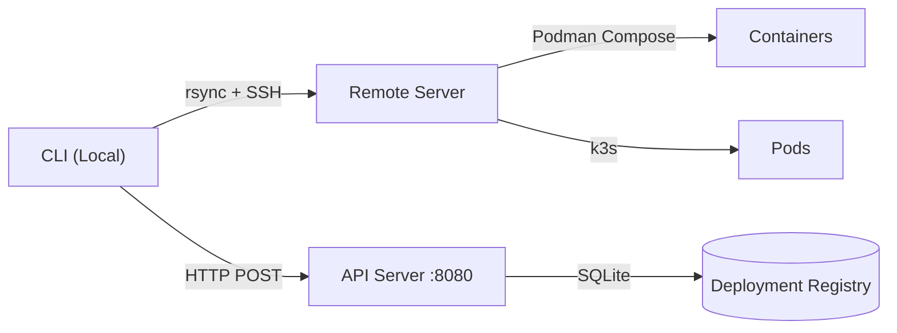

> [!NOTE]
> This README was generated by [SKILL](https://github.com/pardnchiu/skill-readme-generate), get the ZH version from [here](./doc/README.zh.md).

# go-podrun

[](https://pkg.go.dev/github.com/pardnchiu/go-podrun)
[](https://goreportcard.com/report/github.com/pardnchiu/go-podrun)
[](LICENSE)
[](https://github.com/pardnchiu/go-podrun/releases)

> A CLI tool that syncs local projects to remote servers via rsync/SSH and runs Podman Compose workloads — with a local SQLite deployment registry for container lifecycle tracking.

## Table of Contents

- [Features](#features)
- [Architecture](#architecture)
- [File Structure](#file-structure)
- [License](#license)
- [Author](#author)

## Features

### UID-Based Deployment Registry

Each container deployment is assigned a unique identifier derived from the local machine's MAC address and project path. This UID is persisted in a local SQLite database, enabling status queries regardless of container runtime availability. Lifecycle states (`starting → running → failed → removed`) are tracked independently of whether containers are currently running.

### Dual Runtime Targeting

The same CLI command can target either Podman Compose (rootless container workloads) or k3s (Kubernetes semantic environments) via the `--type` flag, eliminating the need to maintain separate toolchains for each runtime.

### SSH/rsync Zero-Setup Remote Execution

Local project files are synchronized to the remote server via rsync and compose commands are executed over SSH using `sshpass`. The remote target machine requires no additional CLI tooling beyond SSH access and a container runtime.

> **Install**
> ```bash
> go install github.com/pardnchiu/go-podrun/cmd/cli@latest
> ```

Full documentation → [doc/doc.md](doc/doc.md)

## Architecture



## File Structure

```
go-podrun/
├── cmd/
│   ├── api/main.go          # API server entry
│   └── cli/main.go          # CLI entry
├── internal/
│   ├── command/             # CLI deploy logic
│   ├── database/            # SQLite operations
│   ├── handler/             # HTTP route handlers
│   ├── model/               # Pod / Record types
│   └── utils/               # SSH, env, IP helpers
├── sql/create.sql           # Schema DDL
└── go.mod
```

## License

This project is licensed under the [GNU Affero General Public License v3.0](LICENSE).

## Author


<h4 style="padding-top: 0">邱敬幃 Pardn Chiu</h4>

<a href="mailto:dev@pardn.io" target="_blank">

</a> <a href="https://linkedin.com/in/pardnchiu" target="_blank">

</a>

## Stars

[](https://starchart.cc/pardnchiu/go-podrun)

---

©️ 2025 [pardnchiu](https://github.com/pardnchiu)
