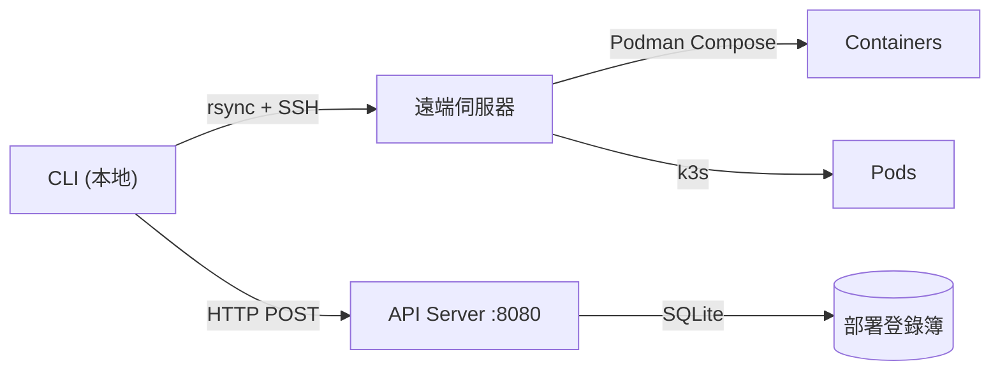

> [!NOTE]
> 此 README 由 [SKILL](https://github.com/pardnchiu/skill-readme-generate) 生成，英文版請參閱 [這裡](../README.md)。

# go-podrun

[](https://pkg.go.dev/github.com/pardnchiu/go-podrun)
[](https://goreportcard.com/report/github.com/pardnchiu/go-podrun)
[](../LICENSE)
[](https://github.com/pardnchiu/go-podrun/releases)

> 一個 CLI 工具，透過 rsync/SSH 將本地專案同步至遠端伺服器並執行 Podman Compose 工作負載，同時使用本地 SQLite 資料庫追蹤容器部署生命週期。

## 目錄

- [功能特色](#功能特色)
- [架構](#架構)
- [目錄結構](#目錄結構)
- [授權](#授權)
- [作者](#作者)

## 功能特色

### 基於 UID 的部署登錄簿

每個容器部署皆分配一組由本機 MAC 地址與專案路徑雜湊衍生的唯一識別碼，並持久化於本地 SQLite 資料庫。狀態查詢不依賴容器 runtime 的可用性，即使容器已停止，仍可追蹤 `starting → running → failed → removed` 完整生命週期。

### 雙 Runtime 目標切換

同一 CLI 指令可透過 `--type` 旗標切換至 Podman Compose（Rootless 容器工作負載）或 k3s（Kubernetes 語意環境），無需維護兩套獨立的部署工具鏈。

### SSH/rsync 零安裝遠端執行

本地專案檔案透過 rsync 同步至遠端伺服器，並以 `sshpass` 搭配 SSH 執行 compose 指令。遠端目標機器無需安裝任何額外 CLI 工具，僅需具備 SSH 存取權限與容器 runtime。

> **安裝**
> ```bash
> go install github.com/pardnchiu/go-podrun/cmd/cli@latest
> ```

完整文件 → [doc.zh.md](doc.zh.md)

## 架構



## 目錄結構

```
go-podrun/
├── cmd/
│   ├── api/main.go          # API server 入口
│   └── cli/main.go          # CLI 入口
├── internal/
│   ├── command/             # CLI 部署邏輯
│   ├── database/            # SQLite 操作
│   ├── handler/             # HTTP 路由處理器
│   ├── model/               # Pod / Record 型別
│   └── utils/               # SSH、env、IP 輔助函式
├── sql/create.sql           # Schema DDL
└── go.mod
```

## 授權

本專案採用 [GNU Affero General Public License v3.0](../LICENSE) 授權。

## 作者


<h4 style="padding-top: 0">邱敬幃 Pardn Chiu</h4>

<a href="mailto:dev@pardn.io" target="_blank">

</a> <a href="https://linkedin.com/in/pardnchiu" target="_blank">

</a>

## Stars

[](https://starchart.cc/pardnchiu/go-podrun)

---

©️ 2025 [pardnchiu](https://github.com/pardnchiu)
